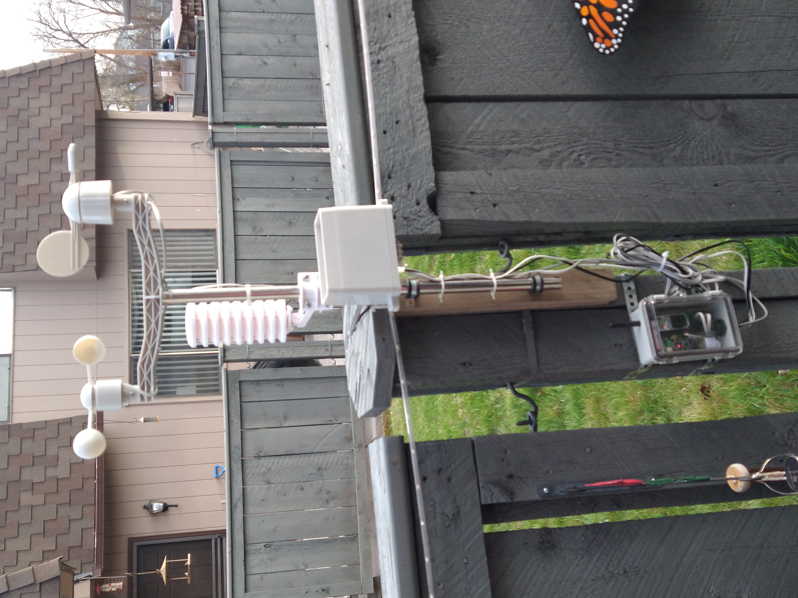
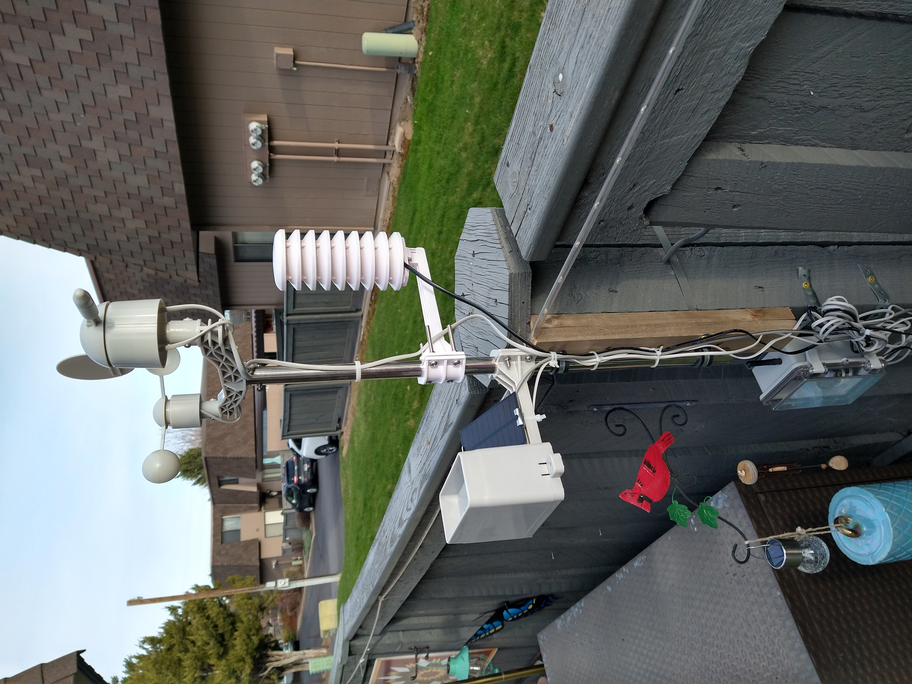
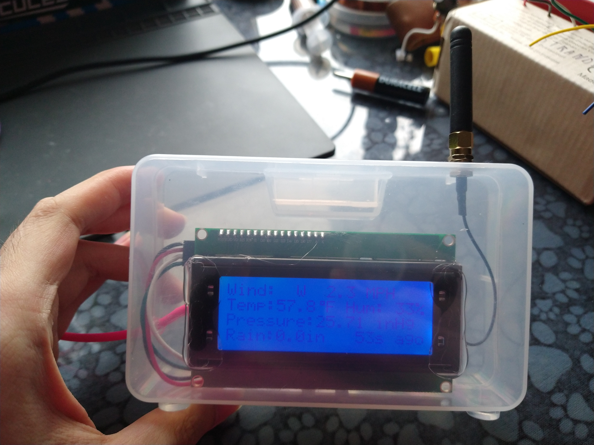
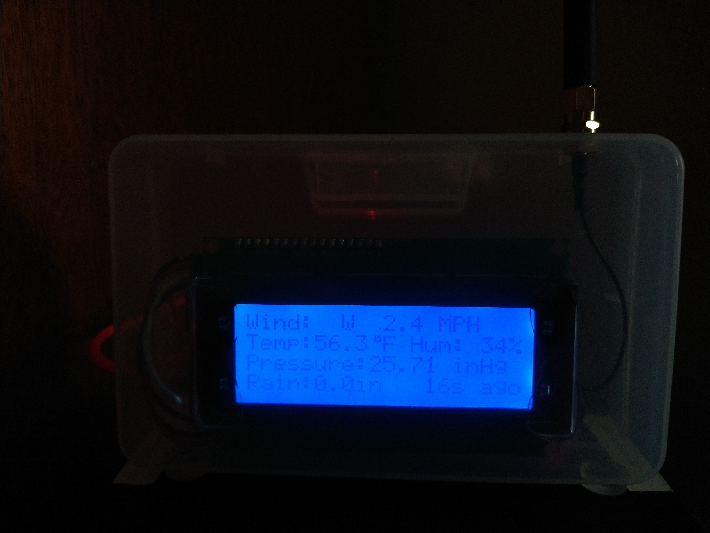
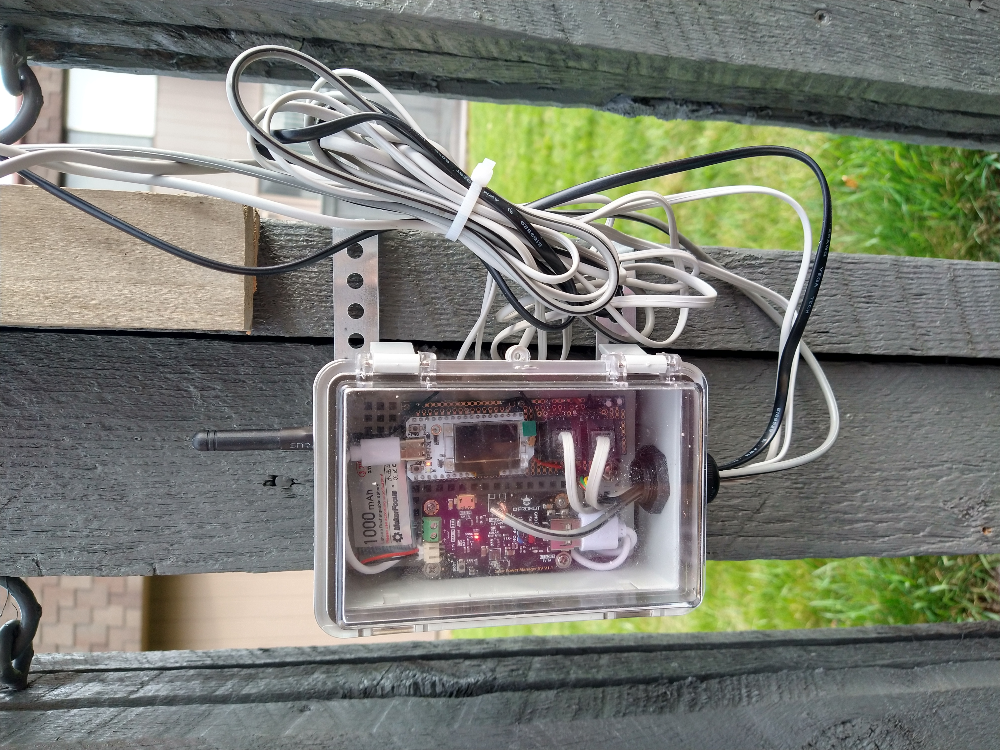
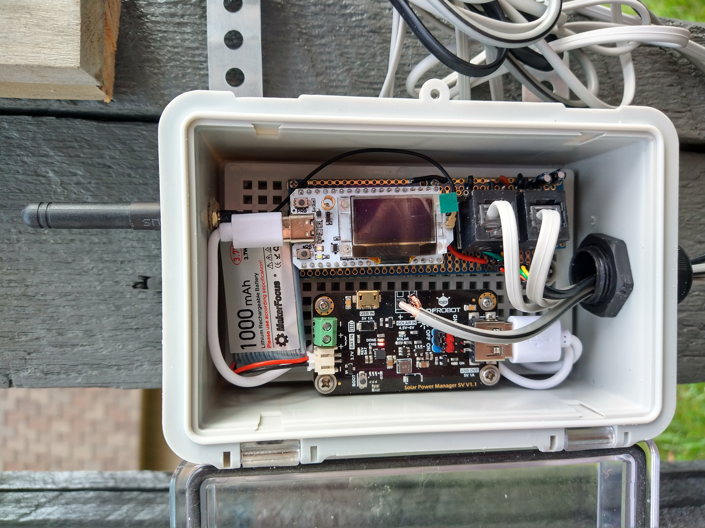

# lora-weather-esp32
Weather station with ESP32 and LoRa

This weather station is capable of measuring wind speed and direction, total rainfall, and current environmental conditions. Conditions include temperature, humidity, and barometric pressure. I put this together because I got interested in microclimate weather. Many rural areas in the United States do not have a weather station nearby, so the conditions you experience may not match what is shown on https://www.weather.gov/ or AccuWeather since the weather station may be over 20 miles away from you. A popular commercially available version of this project is the Ambient Weather WS-2902 (retail: $200 US). However, Ambient Weather does not publish what specific sensors they use in their product, so accuracy is questionable. The wireless range of the sensing unit to the "console" is also on the low end, about 300ft line of sight. On the higher end, there is the KestrelMet 6000 series (starting at $800 US) of stations which is more in line with the capabilities of this project with the option for LTE connectivity (overkill for my purposes).

The system consists of a base station outside where all the sensors are mounted, and a receiver unit that displays the current reading on an LCD. The receiver also connects to wifi and serves a basic webpage with current readings. Webpage (local network only) at http://weather-station.local/

### Current Features
* Atmospheric conditions
  * Temperature - +/-0.5C (BME280)
  * Relative Humidity - +/-2% (SHT31-D)
  * Barometric Pressure - +/- 1.5Pa/K (BME280)
* Wind Speed & Direction (cup-type anemometer, 16 direction weather vane)
* Accumulated Rainfall (tipping bucket type) - seems to be highly accurate. I am getting comparable data to my local weather station. The mounting is susceptible to vibration, so the mast needs to be solidly anchored.
* Self-powered base station
  * 2 watt solar "array"
  * 3000mAh/11Wh battery
  * The only outages I have gotten with this configuration are from user error (forgetting to plug back in the solar panel wires). Have not gotten a dead battery from overcast/rainy days yet.
* Long range wireless connection (untested for "max range" but since this is Arduino, we can configure for more power/signal robustness if needed)
* **NEW** view current weather data from web browser (November 2025)
### Planned Additions (Wishlist)
* ~~Add SHT31 sensor for more accurate humidity data. The BME280 is not designed for "condensing" environments (don't get it wet..)~~ SHT31-D installed
  * Document waterproofing methods for the electronics
* Historical data with LittleFS storage. Store a week or more of data.
* Graph the data via web browser. Possible with a library like [Chart.js](https://www.chartjs.org/)
* Add more configuration capability over LoRa
  * Send calibration commands from indoor receiver
  * Set the time with NTP. Have the data reset at 3AM instead of whenever system reset + 48hrs have passed.

## Hardware
* [MCU Board][mcu] - Heltec WiFi LoRa 32 v3 (ESP32-S3 with SX1262 LoRa modem and SSD1306 0.96" OLED Display)   
* Wind Speed, Wind Direction, and Rain Gauge kit - Available from [Argent Data][argent data kit] or [SparkFun][sparkfun kit].  
* [HiLetGo BME280 breakout board][bme280 board] - measures temperature, humidity, and pressure. The humidity sensor on this device failed after a year (not meant for condensing environments, i.e. fog). If you're building a project like this, go with the cheaper BMP280.
* [HiLetGo SHT31-D breakout board][sht31 board] - measures temperature and humidity. I added it just for the humidity sensing. I suppose according to the specs, the SHT is more accurate for temperature too.
* [DFRobot MPPT 6V Solar Panel Controller][dfrobot board] - charges a LiPo battery with the help of the sun  
* [Ambient Weather Solar Shield/Stevenson Screen][atmo sensor housing] - I didn't want to 3D print anything major for this project, so I found this on Amazon.  
* [2x 5V 1W Solar Panel][solar panel]  
* [3.7V 3000mah LiPo battery][lipo battery]  
* [RJ11 Jack Breakouts][rj11 jacks] - The wind and rain sensor kit uses RJ11 connectors.  
* [Generic LCD2004A LCD module with I2C][lcd i2c module] - for the indoor display.  

[mcu]: https://heltec.org/project/wifi-lora-32-v3/
[sparkfun kit]: https://www.sparkfun.com/products/15901
[argent data kit]: https://www.argentdata.com/catalog/product_info.php?products_id=145
[bme280 board]: https://www.amazon.com/gp/product/B01N47LZ4P/
[sht31 board]: https://www.amazon.com/dp/B0CN32WXJY
[dfrobot board]: https://www.amazon.com/gp/product/B07MML4YJV/
[atmo sensor housing]: https://www.amazon.com/gp/product/B09T4QDBN3/
[solar panel]: https://www.amazon.com/dp/B0BML3PR4Z
[lipo battery]: https://www.amazon.com/dp/B0DK5BBKM5
[rj11 jacks]: https://www.amazon.com/dp/B09HTRKRSH
[lcd i2c module]: https://www.amazon.com/dp/B01GPUMP9C/

## Tools
* [PlatformIO IDE based on VS Code][platformio]   
* [For small tests: Arduino IDE][arduino]   
* [The wonderful RadioLib for using LoRa][radiolib]   
* [ESPAsyncWebServer][asyncwebserver]   

[platformio]: https://platformio.org/platformio-ide
[arduino]: https://www.arduino.cc/en/software
[radiolib]: https://github.com/jgromes/RadioLib
[asyncwebserver]: https://github.com/ESP32Async/ESPAsyncWebServer/wiki

## Photos
These are a bit old, so they don't reflect the most current setup. I have since modified the system with a larger 3000mAh lithium cell and added another solar panel for increased runtime. I *think* the charge should last for more than a couple overcast days now.

